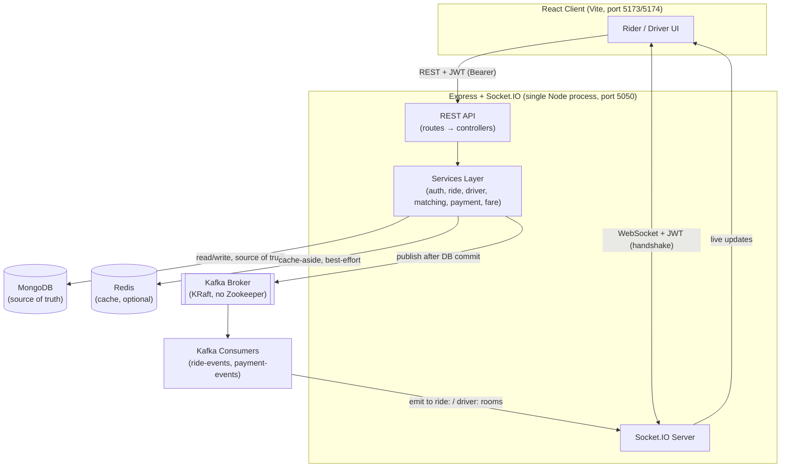
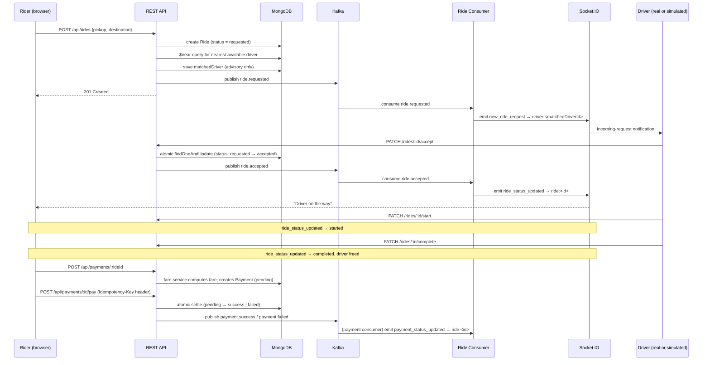
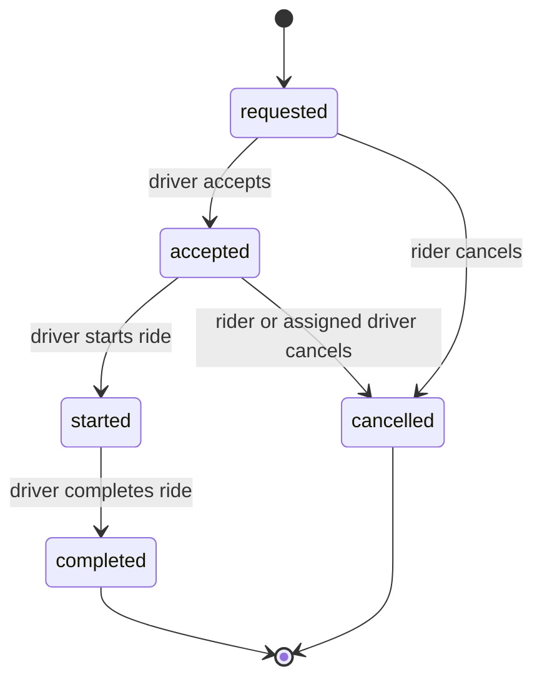

# RideSync

A ride-hailing platform backend and web client built from scratch to demonstrate real backend engineering: event-driven processing with Kafka, geospatial driver matching, Redis caching, real-time updates over Socket.IO, and a race-safe ride/payment state machine — no Docker, no managed PaaS, everything running as native local processes.

## 🚀 Overview

RideSync implements the core workflow of a ride-hailing app end to end: a rider requests a trip, the backend finds and notifies a nearby driver, the driver accepts and drives the trip through to completion, and the rider pays — all synchronized live between both parties over WebSockets.

It was built incrementally as a systems-design learning project (see `server/progress.md` for the day-by-day build log), with a deliberate emphasis on the parts of a real ride-hailing backend that are easy to get *wrong*: race conditions on ride acceptance, idempotent payments, graceful degradation when Redis or Kafka are unavailable, and a real (if intentionally simple) geospatial matching query — rather than a CRUD app with a rideshare theme bolted on.

**Who it's for:** two roles, `rider` and `driver`, sharing one codebase and one set of REST/WebSocket APIs, distinguished entirely by role-based authorization.

## ✨ Key Features

- **JWT authentication** with role-based access control (`rider` / `driver`), enforced identically over REST and Socket.IO
- **Ride lifecycle state machine** (`requested → accepted → started → completed`, plus `cancelled`) with server-enforced valid transitions
- **Geospatial driver matching** via MongoDB `2dsphere` indexes and `$near`, with a Redis GEO fast-path (see [Redis](#-redis) for why it currently falls back)
- **Race-safe ride acceptance** — two drivers tapping "Accept" on the same ride can never both win, via atomic `findOneAndUpdate` + MongoDB transactions
- **Event-driven architecture** with Kafka — every ride/payment transition publishes an event, consumed asynchronously to drive real-time notifications
- **Real-time updates** over Socket.IO — live ride status, driver location, and payment status, plus a personal-room push notification to the matched driver
- **Idempotent, simulated payments** — a pluggable payment-provider interface, a required `Idempotency-Key` header, and an atomic settle step so retries/double-clicks never double-charge
- **Simulated demo drivers** — a seed script plus a background service that plays the part of a real driver app (accept → start → complete) so the whole flow is demoable by a single rider, with zero effect on real drivers
- **Late (retroactive) matching** — a ride that found nobody available gets matched automatically the moment any driver next comes online, instead of staying stranded
- **Graceful degradation** — Redis and Kafka outages never break the REST API; both are optimizations layered on top of MongoDB as the single source of truth

## 🏗️ System Architecture



Everything runs as a **single Node process** (`server/src/server.js`) — Express and Socket.IO share one `http.Server`, not two separate backends. MongoDB, Redis, and Kafka are all external processes reached over the network, but the application code itself is a modular monolith by design (see `server/CLAUDE.md` — explicitly *not* split into microservices).

## 🔄 Complete Ride Flow



If the driver in the diagram is a **simulated** demo driver, steps "accept/start/complete" happen automatically on a timer instead of a human tapping a button — see [Driver Matching](#-driver-matching) and [driverSimulationService.js](server/src/services/driverSimulationService.js).

## 🧩 Architecture / Design

**Service separation, not microservices.** Controllers stay thin (validate → call a service → shape the response); all business logic — the ride state machine, matching, fare calculation, payment idempotency — lives in `server/src/services/`. This is a deliberate modular monolith (see `server/CLAUDE.md` §4/§19): the project's own rules explicitly forbid splitting into microservices or introducing infrastructure (Kubernetes, service mesh) without a concrete reason.

**Event-driven, but not for correctness.** Kafka events describe *things that already happened* — every publish call runs strictly after the corresponding MongoDB write has committed ("database first, then publish"), and consumers never re-run or re-validate business logic; they only log and bridge into a Socket.IO broadcast. This means a Kafka outage delays real-time notifications but never corrupts state — MongoDB is authoritative regardless of whether any event was ever published.

**Concurrency correctness over convenience.** The two places money/assignment could double-happen — a ride being accepted by two drivers, and a payment being settled twice — are both handled with the same pattern: an atomic `findOneAndUpdate` whose filter re-checks the expected current state at write time (`status: "requested"`, `status: "pending"`), wrapped in a MongoDB transaction where a second document also needs to move together (the `Ride` and the `Driver` both changing on accept). A plain read-then-write would have a race window; this doesn't.

**Idempotency where money is involved.** The `POST /payments/:id/pay` endpoint requires an `Idempotency-Key` header. A repeated request with the *same* key returns the already-settled result instead of re-processing — the difference between a network retry being safe and it double-charging.

**Fault tolerance by design, not by accident.** Redis and Kafka are both wrapped so that every failure mode — connection refused, command unsupported, broker unreachable — degrades to "behave as if the cache were empty" / "skip the event" rather than throwing. MongoDB is the only hard dependency; the server refuses to start without it, but runs (with reduced performance/real-time features) without Redis or Kafka.

**State management on the client mirrors the server's state machine exactly** — `RIDE_STEPS` and the ride status badges (`client/src/utils/statusMeta.js`) are a direct copy of `VALID_TRANSITIONS` in `ride.service.js`, so the UI can never represent a state the backend doesn't recognize.

## 🛠️ Tech Stack

| Layer | Technology | Purpose |
|---|---|---|
| Frontend | React 18 + Vite 6 | SPA, fast dev server / build |
| Routing | React Router v6 | Role-gated client-side routing |
| Styling | Tailwind CSS | Utility-first styling |
| HTTP client | Axios | REST calls, auth-header interceptor |
| Real-time (client) | socket.io-client | Live ride/driver/payment updates |
| Backend runtime | Node.js + Express 4 | REST API |
| Database | MongoDB + Mongoose 8 | Persistent source of truth |
| Cache / fast state | Redis (`redis` v4 client) | Driver status cache, live location cache, GEO set |
| Event streaming | Apache Kafka (via `kafkajs`) | Async ride/payment event pipeline |
| Real-time (server) | Socket.IO 4 | WebSocket rooms, live broadcast |
| Auth | `jsonwebtoken` + `bcrypt` | Stateless JWT auth, password hashing |
| Validation | `express-validator` | Request-body/param validation |
| Dev tooling | `nodemon` | Backend auto-restart in development |

No Docker, no cloud managed services, no ORM beyond Mongoose — Redis and Kafka both run as native local processes (see [Installation & Setup](#-installation--setup)).

## 📁 Project Structure

```text
RideSync/
├── start-dev.ps1                # Windows helper: starts Redis/Kafka/backend/frontend if not already running
├── server/
│   ├── scripts/
│   │   └── seedDrivers.js       # Idempotent seed: 6 fictional "simulated" driver accounts
│   ├── src/
│   │   ├── app.js               # Express app: middleware + route mounting
│   │   ├── server.js            # Process entrypoint: connects Mongo/Redis/Kafka, starts HTTP+Socket.IO
│   │   ├── config/               # db, redis, kafka, socket.io, and centralized constants
│   │   ├── models/               # User, Driver, Vehicle, Ride, Payment (Mongoose schemas)
│   │   ├── routes/                # auth, driver, ride, payment route definitions + validators
│   │   ├── controllers/           # Thin HTTP handlers — validate, call a service, respond
│   │   ├── services/              # All business logic (see below)
│   │   ├── middleware/            # JWT auth, role guard, socket auth, centralized error handler
│   │   ├── sockets/               # Socket.IO event handlers (join_ride, driver_location_update)
│   │   ├── consumers/             # Kafka → Socket.IO bridges (ride events, payment events)
│   │   └── utils/                 # ApiError, JWT signing helper
│   └── README.md                 # Detailed day-by-day backend build log and API reference
└── client/
    ├── src/
    │   ├── pages/                # Route-level screens (rider/, driver/, shared)
    │   ├── components/           # Reusable UI + rider/driver-specific composite components
    │   ├── layouts/               # RiderLayout / DriverLayout (shared header + outlet)
    │   ├── context/               # AuthContext (session + socket lifecycle), ToastContext
    │   ├── hooks/                  # useSocketEvent, useJoinRideRoom, useLiveRide, useGeolocation
    │   ├── services/               # api.js (axios) + one file per backend domain
    │   └── utils/                  # Status badge metadata, formatting helpers
    └── README.md                  # Frontend-specific setup notes and known limitations
```

Key services in `server/src/services/`: `auth.service.js`, `driver.service.js`, `ride.service.js` (the state machine), `matching.service.js` (geospatial lookup), `driverSimulationService.js` (demo-only auto-driver), `payment.service.js`, `fare.service.js`, `redis.service.js`, `kafkaProducer.js`.

## 🔐 Authentication & Authorization

- **Mechanism:** JWT, signed with `JWT_SECRET`, containing `{ id, role }`, expiring after `JWT_EXPIRES_IN` (default `7d`).
- **Password handling:** hashed with `bcrypt` (10 salt rounds) before storage; the schema marks `password` as `select: false`, and `toJSON` strips it from every serialized `User` regardless.
- **REST auth:** `Authorization: Bearer <token>` header, verified by `auth.middleware.js`, which **re-fetches the User from MongoDB on every request** rather than trusting the JWT's embedded role — a role change or account deletion takes effect immediately, not only after the token expires.
- **Socket.IO auth:** the same JWT is sent once, in the connection handshake (`socket.handshake.auth.token`), verified by `socketAuth.middleware.js` using the identical `JWT_SECRET` and `User` lookup — one auth system, not two.
- **Roles:** exactly two, `rider` and `driver`, fixed at registration (no admin role, no role-switching).
- **Authorization:** `role.middleware.js`'s `requireRole(...roles)` gates entire route groups (e.g. all of `/api/drivers/*` requires `driver`); ownership checks beyond role (e.g. "is this *your* ride?") are re-verified inside each service function from `req.user`, never trusted from a route parameter alone.
- **Client-side session storage:** the JWT and user object are kept in `sessionStorage`, not `localStorage` — a deliberate choice so that two browser tabs of the same browser can hold two independent logged-in sessions (e.g. testing as a rider and a driver simultaneously) instead of silently sharing one.

## 🚗 Ride Lifecycle / State Machine

States (from `server/src/models/Ride.js`): `requested`, `accepted`, `started`, `completed`, `cancelled`.



Transitions are enforced centrally by `VALID_TRANSITIONS` in `ride.service.js` — any other transition (e.g. `completed → started`) is rejected with `400` before touching the database. Notably, a `started` ride **cannot** be cancelled (matches the state map exactly — once underway, it can only complete).

`Driver` has its own, simpler status enum — `offline | available | busy` — that moves in lockstep with the ride: accepting sets the driver `busy`, completing or cancelling an accepted ride sets them back to `available`.

## 📍 Driver Matching

1. **Trigger:** every `POST /api/rides` (ride creation) runs `matching.service.js#findNearestAvailableDriver(pickupCoordinates)` once, synchronously.
2. **Geospatial query:** MongoDB's `2dsphere` index on `Driver.currentLocation`, queried with `$near` and `$maxDistance: DRIVER_SEARCH_RADIUS_METERS` (default 25 km) — `$near` already returns nearest-first, so no in-memory sort is needed.
3. **Real drivers preferred over simulated ones:** the query runs in two passes — first only `isSimulated: { $ne: true }` drivers, and only if that finds nobody does it fall back to `isSimulated: true` drivers. This matters because the seeded demo drivers sit at fixed coordinates and would otherwise sometimes out-compete a real driver testing from the same area on pure distance.
4. **Redis fast path (currently inactive — see [Redis](#-redis)):** designed to check a Redis GEO set first and skip straight to that driver's record; on this deployment it never returns a hit, so the MongoDB query above is what actually runs on every request.
5. **Result is advisory, not a reservation.** The matched driver is stored on `Ride.matchedDriver` purely so the correct driver can be pushed a real-time notification — **any** currently-available driver can still call `PATCH /rides/:id/accept` and win, exactly like a real dispatch system where a suggestion isn't a lock.
6. **Acceptance is race-safe:** `acceptRide` does a cheap Redis-cached pre-check, then an atomic `findOneAndUpdate` (`status: "requested"` in the filter) inside a MongoDB transaction that also flips the `Driver` to `busy` — the loser of a two-driver race gets a clean `409`, never a corrupted ride.
7. **No available driver:** the ride is still created (status `requested`, `matchedDriver: null`) rather than failing outright — the client detects this from the response and shows "No drivers available" instead of spinning forever.
8. **Late/retroactive matching:** `ride.service.js#matchWaitingRideToDriver`, called whenever a driver becomes `available` (manual "go online," or freed after completing/cancelling a ride), does one more atomic `$near` lookup against any still-unmatched `requested` ride — so a ride that found nobody at creation time gets matched the moment someone next comes online, instead of being permanently stranded.

## ⚡ Redis

Redis is used purely as a performance/optimization layer — MongoDB remains the source of truth for everything, and every Redis operation in `redis.service.js` checks `client.isReady` and swallows errors, falling back to MongoDB on any failure.

| Data | Key pattern | TTL | Purpose |
|---|---|---|---|
| Driver status | `driver:status:<userId>` | `REDIS_DRIVER_TTL_SECONDS` (30s default) | Cache-aside fast-fail check before `acceptRide`'s transaction — never the final word |
| Available drivers' locations | `drivers:geo` (GEO sorted set) | none (membership managed explicitly) | Intended fast nearest-driver lookup via `GEOSEARCH` |
| A ride's live driver location | `ride:<rideId>:driver-location` | `REDIS_RIDE_LOCATION_TTL_SECONDS` (120s default) | Written on every `driver_location_update` socket event; **Redis-only**, never persisted to MongoDB (too high-frequency) |

**Status: Partially working — `GEOSEARCH` is non-functional on this deployment.** `GEOSEARCH` was only added in Redis 6.2, and the portable Windows Redis build this project uses (`tporadowski/redis`, v5.0.14.1 — the newest available from that source) doesn't support it. Every geo lookup fails with "unknown command," is caught, logged once at startup (not on every request), and falls through to the MongoDB `$near` query described above. Driver matching is fully correct either way — this only means the Redis fast path is currently dead code on Windows; it would activate automatically on a Redis 6.2+ deployment (e.g. Linux/macOS via the OS package manager) without any code change.

## 📨 Apache Kafka / Event-Driven Architecture

**Status: Implemented**, running as a native KRaft-mode broker (no Zookeeper, no Docker).

| Topic | Consumer group | Events |
|---|---|---|
| `ride-events` | `ridesync-ride-consumers` | `ride.requested`, `ride.accepted`, `ride.started`, `ride.completed`, `ride.cancelled` |
| `payment-events` | `ridesync-payment-consumers` | `payment.created`, `payment.success`, `payment.failed` |

- **Producer** (`kafkaProducer.js`): publishes only *after* the corresponding MongoDB write has committed. Every event is wrapped in an envelope — `{ eventId (UUID), eventType, timestamp, version, data }` — and keyed by `rideId`, so every event for one ride lands on the same partition and is delivered in order. A publish never throws or fails the API request; a failure is logged and the producer marks itself disconnected (by design, this project does not auto-reconnect in the background — a broker outage requires a process restart to resume publishing, a documented, deliberate scope boundary rather than a bug).
- **Consumers** (`rideEventConsumer.js`, `paymentEventConsumer.js`): each subscribes from `fromBeginning: false` (only events produced from now on), and each `eachMessage` handler is wrapped so it can never throw — a malformed message is logged and skipped rather than stalling the consumer. Consumers do **not** re-run business logic; MongoDB is already authoritative by the time an event arrives. Their only two jobs are (1) log the event and (2) bridge it into a Socket.IO broadcast — `ride_status_updated` / `payment_status_updated` to the ride's room, and, uniquely for `ride.requested`, a `new_ride_request` push to the specific matched driver's personal room.
- **Why Kafka here:** it decouples "a ride's state changed" from "who needs to know and how" — the REST request that changes the ride never blocks on notifying anyone; a separate process picks that up whenever it's ready, and the same event stream could gain new consumers (analytics, a fraud-check service) without touching `ride.service.js` at all.
- **Not implemented:** no dead-letter queue, no consumer-side deduplication (every event already carries the `eventId` such a check would key off), and no retry topic. Only a single consumer instance runs per group today, though the consumer-group model means adding more is a deployment change, not a code change.

## 🔌 Real-Time Communication

**Status: Implemented**, Socket.IO attached to the same `http.Server` as Express (one port, both protocols).

- **Auth:** JWT verified once at connection handshake (`socketAuth.middleware.js`) — no per-message re-authentication.
- **Rooms:**
  - `ride:<rideId>` — joined via the `join_ride` client event; the server re-checks the caller is the ride's rider or its assigned driver before allowing the join (an outsider gets `ride_error`).
  - `driver:<userId>` — every driver socket auto-joins its own room on connect, which is what lets the backend push a notification to one specific driver who hasn't joined any ride room yet (they haven't accepted anything to be a "participant" of).
- **Client → server events:** `join_ride`, `driver_location_update` (driver-role only, throttled server-side to one update per 2 seconds per driver, in-memory).
- **Server → client events:** `ride_joined`, `ride_status_updated`, `driver_location_updated`, `payment_status_updated`, `new_ride_request`, `ride_error`.
- **Connection handling:** the client (`client/src/services/socket.js`) reconnects with unlimited attempts and capped exponential backoff (1s → 5s max) — deliberately unbounded rather than a fixed retry count, so a longer outage can't permanently strand an open tab with no live updates until the user manually refreshes.
- **Room re-join on reconnect:** `useJoinRideRoom` re-emits `join_ride` on every `connect` event (initial connect and every reconnect), since Socket.IO does not remember room membership across a dropped connection.

## 💳 Payments

**Status: Simulated — no real payment gateway is integrated.** `server/CLAUDE.md` lists Razorpay as an aspirational tech-stack goal, but no Razorpay (or any) SDK appears in `package.json`, and no API keys/webhooks exist in the code. What's actually implemented is a complete, correct payment *state machine and idempotency layer* around a pluggable, swappable provider interface — the part of "payments" that's genuinely hard to get right, deliberately built provider-agnostically:

```js
// services/paymentProviders/simulatedPaymentProvider.js contract:
charge({ amount, currency, requestedResult }) -> Promise<{ status, providerReference, failureReason }>
```

- **Fare calculation:** backend-only, from the ride's own persisted pickup/destination coordinates and `startedAt`/`completedAt` timestamps — Haversine straight-line distance × `FARE_PER_KM`, plus duration × `FARE_PER_MINUTE`, plus `FARE_BASE`. The client never sends an amount.
- **One payment per ride, forever:** `Payment.ride` has a unique index — a second `createPayment` call for the same ride returns the *existing* payment (idempotent by construction), and a failed payment cannot be retried with a new document (a real system would add that; documented here as a known limitation rather than silently missing).
- **Idempotent settlement:** `POST /payments/:id/pay` requires an `Idempotency-Key` header; a repeated request with the same key returns the already-settled result. The actual state flip (`pending → success | failed`) is an atomic `findOneAndUpdate` guarded by `status: "pending"`, the same race-safety pattern as ride acceptance.
- **`requestedResult` in the request body** exists only because this is a simulator with no real gateway to ask — it mirrors how real providers offer test-mode cards that deterministically succeed/fail, letting both outcomes be exercised without moving real money; it never bypasses the ownership/state-machine/idempotency checks above it.
- **Planned:** swapping in a real gateway (e.g. Razorpay) means writing one new file implementing the same `charge()` contract — no change to the `Payment` model, the state machine, the controller, the routes, or the Kafka/Socket.IO wiring.

## 🌐 API Documentation

All routes are mounted under `/api` (see `server/src/app.js`). `Auth` = requires a valid `Authorization: Bearer <token>` header; `Role` = additionally requires that specific role.

**Health**

| Method | Endpoint | Description | Auth |
|---|---|---|---|
| GET | `/api/health` | Liveness check | No |

**Auth**

| Method | Endpoint | Description | Auth |
|---|---|---|---|
| POST | `/api/auth/register` | Create a `rider` or `driver` account | No |
| POST | `/api/auth/login` | Log in, receive a JWT | No |

**Drivers** *(all require `driver` role)*

| Method | Endpoint | Description | Auth |
|---|---|---|---|
| GET | `/api/drivers/me` | Get the caller's own driver profile (404 if onboarding incomplete) | Driver |
| POST | `/api/drivers/profile` | Complete onboarding: vehicle type/brand/model/registration | Driver |
| PATCH | `/api/drivers/status` | Set `offline` \| `available` \| `busy` | Driver |
| PATCH | `/api/drivers/location` | Update current `[longitude, latitude]` | Driver |

**Rides**

| Method | Endpoint | Description | Auth |
|---|---|---|---|
| POST | `/api/rides` | Request a ride (pickup + destination) | Rider |
| GET | `/api/rides/my-rides` | Paginated ride history for the caller | Any |
| GET | `/api/rides/:id` | Get one ride (rider or assigned driver only) | Any |
| PATCH | `/api/rides/:id/accept` | Accept a `requested` ride | Driver |
| PATCH | `/api/rides/:id/start` | Start an `accepted` ride | Driver |
| PATCH | `/api/rides/:id/complete` | Complete a `started` ride | Driver |
| PATCH | `/api/rides/:id/cancel` | Cancel a `requested`/`accepted` ride | Rider or Driver |

**Payments**

| Method | Endpoint | Description | Auth |
|---|---|---|---|
| POST | `/api/payments/:rideId` | Create a payment for a `completed` ride (idempotent) | Rider |
| GET | `/api/payments/:paymentId` | Get one payment (owning rider only) | Rider |
| POST | `/api/payments/:paymentId/pay` | Simulate settlement — requires `Idempotency-Key` header | Rider |

## ⚙️ Environment Variables

**`server/.env`**

```env
PORT=5050
MONGO_URI=mongodb://127.0.0.1:27017/ride-hailing
JWT_SECRET=change_this_secret
JWT_EXPIRES_IN=7d
# Radius (meters) for the driver-matching geospatial query
DRIVER_SEARCH_RADIUS_METERS=25000
REDIS_URL=redis://localhost:6379
REDIS_DRIVER_TTL_SECONDS=30
REDIS_RIDE_LOCATION_TTL_SECONDS=120
KAFKA_BROKERS=localhost:9092
KAFKA_CLIENT_ID=ridesync-backend
# Simulated fare formula: FARE_BASE + distanceKm*FARE_PER_KM + durationMinutes*FARE_PER_MINUTE
FARE_BASE=50
FARE_PER_KM=15
FARE_PER_MINUTE=2
PAYMENT_CURRENCY=INR
```

**`client/.env`**

```env
VITE_API_URL=http://localhost:5050/api
VITE_SOCKET_URL=http://localhost:5050
```

## 💻 Installation & Setup

This project intentionally runs everything as **native local processes — no Docker**.

**Prerequisites**

- Node.js 18+ and npm
- MongoDB (local install, or a free MongoDB Atlas cluster — either works with `MONGO_URI`)
- Redis (native build — e.g. `tporadowski/redis` on Windows, or `brew install redis` / `apt install redis-server` on macOS/Linux)
- A JDK (for Kafka) + Apache Kafka 3.x, run in **KRaft mode** (no Zookeeper needed)

**1. Clone and install dependencies**

```bash
git clone https://github.com/Preksha-Patel1/RideSync.git
cd RideSync
cd server && npm install
cd ../client && npm install
```

**2. Configure environment variables**

```bash
cd server && cp .env.example .env   # edit MONGO_URI / JWT_SECRET as needed
cd ../client && cp .env.example .env
```

**3. Start MongoDB, Redis, and Kafka**

Start MongoDB and Redis normally for your OS. For Kafka (one-time storage format, then start the broker):

```bash
# from your Kafka install directory
bin/kafka-storage.sh random-uuid                                          # copy the printed UUID
bin/kafka-storage.sh format -t <uuid> -c config/kraft/server.properties
bin/kafka-server-start.sh config/kraft/server.properties

# create the two topics once
bin/kafka-topics.sh --create --topic ride-events    --bootstrap-server localhost:9092 --partitions 1 --replication-factor 1
bin/kafka-topics.sh --create --topic payment-events --bootstrap-server localhost:9092 --partitions 1 --replication-factor 1
```

(Windows users: `start-dev.ps1` at the repo root automates starting Redis, Kafka, the backend, and the frontend in the right order, skipping any that are already running — see [Running the Project](#️-running-the-project). Note it currently hardcodes one developer's local install paths (`C:\Users\...\redis`, `C:\kafka`), so treat it as a template to adapt to your own machine rather than a portable script.)

**4. Seed demo drivers (optional but recommended)**

```bash
cd server
npm run seed:drivers
```

This creates 6 fictional, always-available driver accounts so a solo rider can see the full ride lifecycle without a second browser session — see [Driver Matching](#-driver-matching). Safe to re-run; it upserts by email rather than duplicating.

**5. Start the backend, then the frontend**

```bash
cd server && npm run dev     # http://localhost:5050
cd client && npm run dev     # http://localhost:5173
```

**6. Open the app** at `http://localhost:5173`, register as a rider (and optionally a driver, in a second tab — sessions are per-tab, see [Authentication](#-authentication--authorization)), and request a ride.

## ▶️ Running the Project

| Location | Command | Purpose |
|---|---|---|
| `server/` | `npm run dev` | Start the backend with `nodemon` (auto-restart on file change) |
| `server/` | `npm start` | Start the backend once, no auto-restart |
| `server/` | `npm run seed:drivers` | Seed/refresh the 6 simulated demo drivers |
| `client/` | `npm run dev` | Start the Vite dev server |
| `client/` | `npm run build` | Production build to `client/dist/` |
| `client/` | `npm run preview` | Preview the production build locally |
| repo root (Windows) | `powershell -ExecutionPolicy Bypass -File start-dev.ps1` | Start Redis, Kafka, backend, and frontend together, skipping anything already running |

## 🧪 Testing

**Status: No automated test suite.** There is no Jest/Mocha/Vitest configuration and no `test` script in either `package.json` — this project has been verified through manual API testing (Postman, per `server/CLAUDE.md`) and manual end-to-end browser testing of both the rider and driver flows. Adding automated tests (unit tests for `fare.service.js`'s pure calculation, integration tests for the ride/payment state machines) is listed under [Future Roadmap](#️-future-roadmap).

## 📊 Scalability Considerations

**Implemented today:**
- Stateless REST auth (JWT, no server-side session store) — any number of API instances could sit behind a load balancer with no sticky-session requirement for REST traffic.
- MongoDB `2dsphere` and unique indexes (email, phone, vehicle registration, one-payment-per-ride) keep the hot queries (geospatial matching, "does this exist") index-backed rather than full scans.
- Kafka consumer groups are already named and structured for multiple consumer instances — scaling ride-event processing horizontally is a deployment change (start more instances in the same group), not a code change.
- Redis is used as a cache-aside layer specifically so MongoDB isn't hit on every hot-path read (driver status checks on every accept attempt).

**Not yet implemented — genuine barriers to running >1 backend instance:**
- **Socket.IO room state is in-process memory.** Running two backend instances behind a load balancer would split Socket.IO connections across them with no shared room state — a `ride:<id>` broadcast from instance A would never reach a socket connected to instance B. A production deployment would need the official [`@socket.io/redis-adapter`](https://socket.io/docs/v4/redis-adapter/) to fan broadcasts out across instances.
- **The driver-location throttle map** (`rideSocket.js`'s `lastLocationUpdateAt`) is a plain in-memory `Map`, correct for one process, meaningless once there's more than one.
- **The Kafka producer's "give up after one send failure" behavior** (see [Kafka](#-apache-kafka--event-driven-architecture)) would need a real reconnect/health-check loop in production rather than requiring a process restart.
- No distributed lock is used anywhere — it isn't needed today because MongoDB's atomic `findOneAndUpdate` + transactions already provide the only concurrency guarantees this app requires; a future feature needing cross-service coordination might introduce one.

## 🛡️ Error Handling & Reliability

- **Centralized error handling** — every controller forwards to a single `errorHandler` middleware (`error.middleware.js`), which normalizes Mongoose `ValidationError`/`CastError` and MongoDB duplicate-key (`11000`) errors into a consistent `{ success: false, message, errors? }` response shape, and only logs full stack traces outside `NODE_ENV=production`.
- **Input validation** on every mutating route via `express-validator` (`auth.routes.js`, `driver.routes.js`, `ride.routes.js`, `payment.routes.js`) — coordinates are range-checked, enums are checked against the model's allowed values, before a request ever reaches a service.
- **Idempotency** on payment settlement (`Idempotency-Key` header, see [Payments](#-payments)) and effectively on payment creation (`POST /payments/:rideId` is safe to call twice — it returns the existing payment rather than erroring or duplicating).
- **Optional-dependency degradation**, applied consistently to both Redis and Kafka: a connection failure at startup is logged and the app continues; every subsequent call checks readiness first and falls back rather than throwing or hanging a request.
- **Atomic concurrency guards** (detailed under [Driver Matching](#-driver-matching) and [Payments](#-payments)) are the actual reliability mechanism preventing double-acceptance and double-charging — not a retry loop layered on top of a race condition.

## 🔒 Security Considerations

**Implemented:**
- Passwords hashed with `bcrypt` (10 rounds); the field is `select: false` and stripped from every JSON response.
- JWTs are re-verified against a live `User` lookup on every request (not just signature-checked), so a deleted/role-changed account is rejected immediately.
- Role-based authorization on every driver-only and rider-only route, plus ownership re-checks inside services (never trusting a route parameter alone).
- Financial state changes (payment settlement) require an idempotency key, closing the "double-click charges twice" class of bug.

**Not implemented — recommended for a production deployment:**
- CORS currently allows all origins (`cors()` default, and Socket.IO's CORS is also `origin: "*"`) — fine for local development, should be restricted to a known frontend origin in production.
- No rate limiting on `/api/auth/login` or `/api/auth/register` (brute-force / credential-stuffing protection).
- No refresh-token rotation — a single JWT is valid for its full 7-day lifetime with no revocation mechanism short of changing `JWT_SECRET` for everyone.
- No email verification on registration.

## 📈 Performance Considerations

- **Geospatial queries are index-backed**, not collection scans — `2dsphere` indexes exist on `Driver.currentLocation` and both `Ride.pickup.location` / `Ride.destination.location`.
- **Redis cache-aside on the hottest read:** `acceptRide` checks a cached driver status before ever opening a MongoDB transaction, so a driver who's already busy is rejected in one Redis round trip instead of a transactional write attempt.
- **High-frequency writes are kept out of MongoDB entirely:** live driver GPS pings during an active ride are written only to Redis (`REDIS_RIDE_LOCATION_TTL_SECONDS`), never to MongoDB, which would otherwise take that write volume for data nobody needs after the ride ends.
- **Client-side socket flood protection:** driver location updates are throttled server-side to one per 2 seconds per driver before they're even broadcast, regardless of how fast the browser samples GPS.
- **`.lean()` queries** are used for every read-only ride response (`ride.service.js#populateRide`) — skipping Mongoose document hydration/casting overhead for data that's only ever serialized straight to JSON.

## 🧑‍💻 Example Usage

1. Register as a rider at `/register`, or a driver (which then requires a one-time vehicle-onboarding form before going online).
2. As a rider, from the dashboard: set a pickup and destination (via the browser's geolocation or tapping the map placeholder) and click **Request Ride**.
3. The backend finds the nearest available driver (real or one of the seeded demo drivers) and pushes them a live notification.
4. The driver taps **Accept** (or, for a demo driver, this happens automatically after a short delay) — the rider's screen updates to "Driver on the way" in real time, with no refresh.
5. The driver taps **Start Ride**, then **Complete Ride** — the rider sees each transition live.
6. Once completed, the rider goes to the ride's payment screen, which shows a backend-calculated fare, and simulates payment — a success or failure response comes back atomically and idempotently.
7. Both the rider and driver see the completed ride (with fare/payment status) in their ride history.


