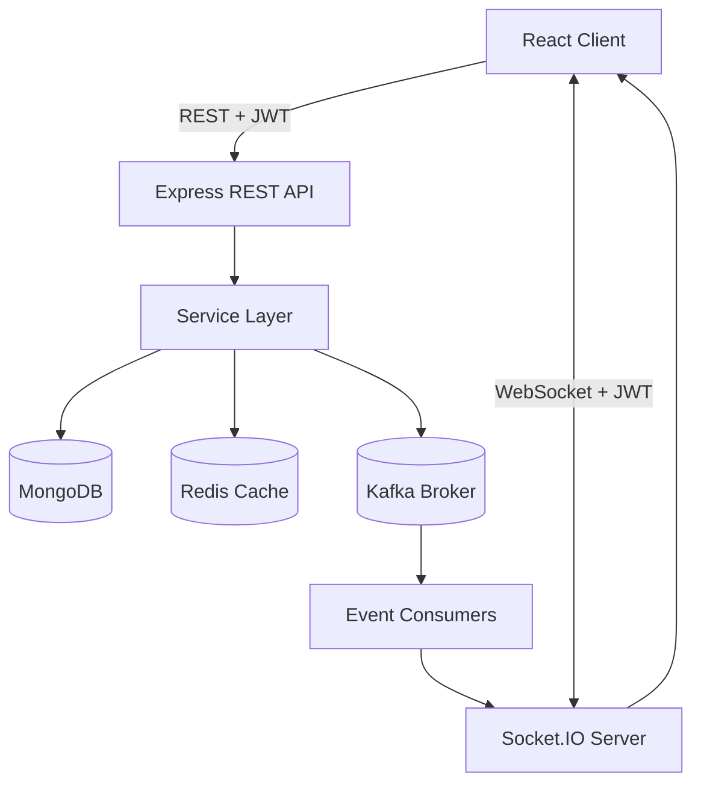
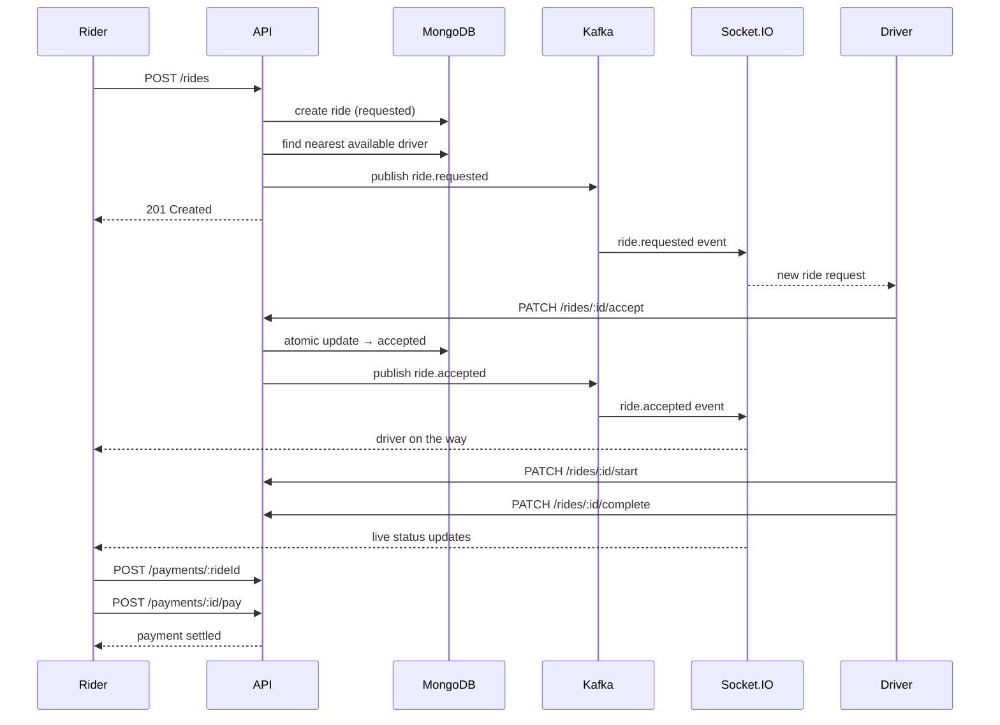
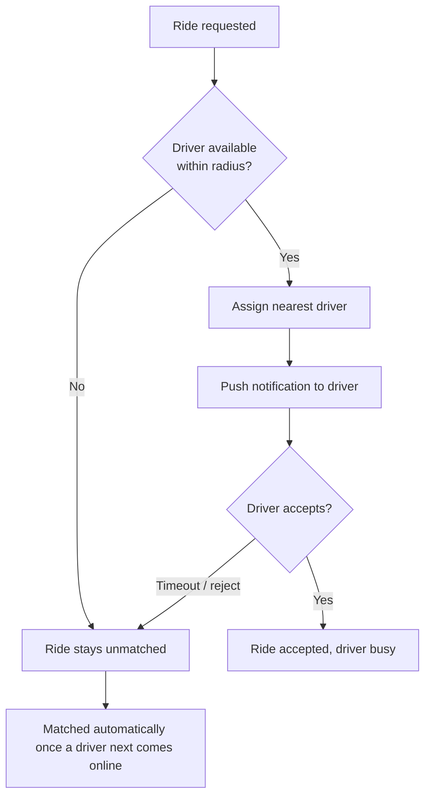
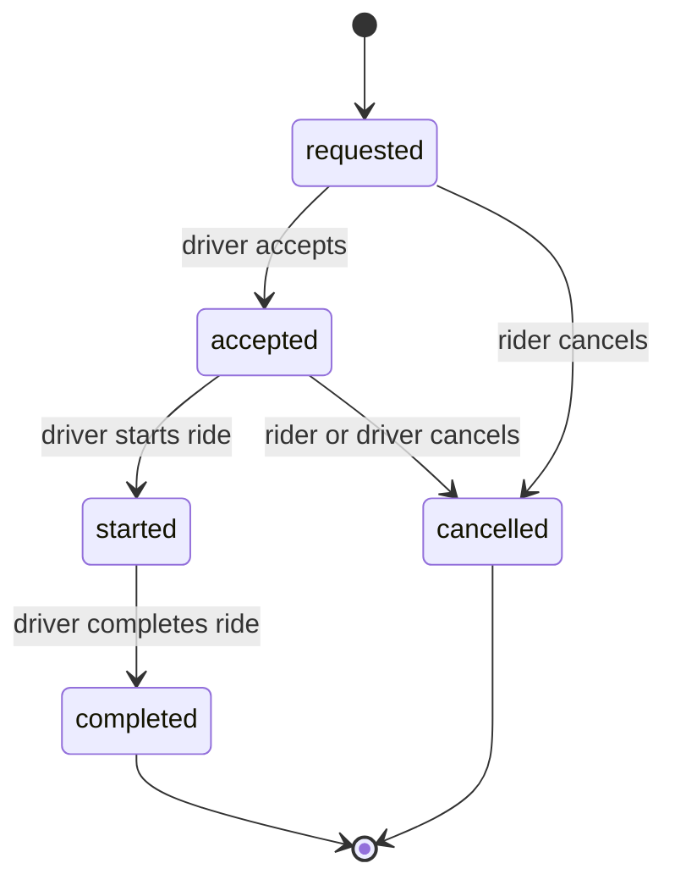

# RideSync

A ride-hailing platform with real-time driver matching, event-driven ride processing, and live tracking — built with a Node.js/Express backend and a React frontend.

## 🚀 Overview

RideSync implements the full ride-hailing workflow: a rider requests a trip, the system matches and notifies a nearby driver, the driver accepts and drives the trip through to completion, and the rider pays — all synchronized live between both parties over WebSockets.

The backend is built around an event-driven core (Kafka), a geospatial matching engine (MongoDB + Redis), and a race-safe state machine for rides and payments — the pieces that make a ride-hailing system nontrivial to get right.

## ✨ Key Features

- **JWT authentication** with role-based access (`rider` / `driver`), enforced identically over REST and WebSockets
- **Ride lifecycle state machine** (`requested → accepted → started → completed`, plus `cancelled`) with server-enforced valid transitions
- **Geospatial driver matching** via MongoDB geospatial indexes, backed by a Redis GEO cache layer
- **Race-safe ride acceptance** — concurrent accept attempts are resolved atomically; only one driver can ever win a ride
- **Event-driven pipeline** with Kafka — every ride/payment transition publishes an event, consumed asynchronously to drive notifications
- **Real-time updates** over Socket.IO — live ride status, driver location, and payment status
- **Idempotent payments** — a pluggable payment-provider interface with idempotency-key protected settlement, so retries never double-charge
- **Autonomous driver mode** — a background service that can play the role of a driver (accept → start → complete) for demos and load testing
- **Retroactive matching** — a ride left unmatched gets picked up automatically the moment a driver next comes online
- **Graceful degradation** — Redis and Kafka outages never take down the API; MongoDB remains the single source of truth

## 🏗️ System Architecture



Express and Socket.IO run in a single process, sharing one HTTP server. MongoDB is the system of record; Redis and Kafka are both optimization layers that the app degrades gracefully without.

## 🔄 Ride Flow



## 📍 Driver Matching



Matching runs on a MongoDB geospatial `$near` query (2dsphere index), with a Redis GEO set as a fast-path cache in front of it. A match is advisory, not a lock — any available driver can still accept, and acceptance itself is resolved with an atomic conditional update wrapped in a transaction, so two drivers can never both win the same ride.

## 🚗 Ride State Machine



Driver status moves alongside it: `offline → available → busy`, flipping to `busy` on acceptance and back to `available` on completion or cancellation.

## 🛠️ Tech Stack

| Layer | Technology | Purpose |
|---|---|---|
| Frontend | React 18 + Vite | SPA, routing, build tooling |
| Styling | Tailwind CSS | UI |
| HTTP client | Axios | REST communication |
| Real-time (client) | socket.io-client | Live updates |
| Backend | Node.js + Express | REST API |
| Database | MongoDB + Mongoose | Persistent storage, geospatial queries |
| Cache | Redis | Driver status/location cache, GEO index |
| Messaging | Apache Kafka (kafkajs) | Event-driven ride/payment pipeline |
| Real-time (server) | Socket.IO | WebSocket rooms and broadcasts |
| Auth | JWT + bcrypt | Stateless authentication, password hashing |
| Validation | express-validator | Request validation |

## 📁 Project Structure

```text
RideSync/
├── server/
│   ├── scripts/seedDrivers.js   # Seeds demo driver accounts
│   └── src/
│       ├── config/              # DB, Redis, Kafka, Socket.IO, constants
│       ├── models/               # User, Driver, Vehicle, Ride, Payment
│       ├── routes/                # Route definitions + validators
│       ├── controllers/           # Thin HTTP handlers
│       ├── services/              # Business logic (auth, ride, matching, payment...)
│       ├── middleware/            # Auth, role guard, error handling
│       ├── sockets/               # Socket.IO event handlers
│       └── consumers/             # Kafka → Socket.IO event bridges
└── client/
    └── src/
        ├── pages/                # Route-level screens
        ├── components/           # UI components
        ├── layouts/               # Rider / driver layouts
        ├── context/               # Auth + socket session state
        ├── hooks/                  # Socket/ride hooks
        └── services/               # API clients
```

## 🔐 Authentication & Authorization

- JWT (`{ id, role }`) signed on login/register, verified on every request against a live database lookup — not just a signature check.
- Passwords hashed with bcrypt; never returned in any API response.
- The same JWT authenticates Socket.IO connections at handshake time.
- Two roles, `rider` and `driver`, each restricted to their own routes and their own rides — ownership is re-verified server-side on every request, never trusted from a URL parameter.
- Sessions are kept per browser tab, so a rider and a driver can be logged in simultaneously in two tabs of the same browser.

## ⚡ Real-Time, Messaging & Caching

- **Socket.IO** rooms: a per-ride room (`ride:<id>`, joined by the rider and assigned driver) and a personal per-driver room used to push new-ride notifications before a driver has joined any ride. Events: `ride_status_updated`, `driver_location_updated`, `payment_status_updated`, `new_ride_request`. The client reconnects automatically with backoff, so a dropped connection recovers without a page refresh.
- **Kafka** carries two topics — `ride-events` and `payment-events` — each with its own consumer group. Every ride/payment transition is written to MongoDB first and published only after that write commits, so events describe facts that have already happened; consumers only log and broadcast, never re-decide state. This decouples "the ride changed" from "who needs telling."
- **Redis** caches driver status (fast-fail check before an accept transaction) and a driver's live location during an active ride, and backs a GEO index used as a fast path in front of the MongoDB geospatial query. Every Redis call is wrapped to fall back to MongoDB on any failure, so a Redis outage degrades performance, never correctness.

## 💳 Payments

Payments run through a pluggable provider interface — `charge({ amount, currency }) → { status, providerReference }` — with a simulated processor as the active provider for development and testing, and a `Payment` state machine (`pending → success | failed`) that's fully idempotent: settlement requires an `Idempotency-Key` header, and a repeated request with the same key returns the original result instead of processing twice. Fare is calculated server-side from the ride's actual distance and duration; the client never supplies an amount. Swapping in a live gateway means implementing the same provider interface — no change to the model, state machine, or API surface.

## 🌐 API Reference

**Auth**

| Method | Endpoint | Description | Auth |
|---|---|---|---|
| POST | `/api/auth/register` | Create a rider or driver account | No |
| POST | `/api/auth/login` | Log in, receive a JWT | No |

**Drivers** *(driver role required)*

| Method | Endpoint | Description |
|---|---|---|
| GET | `/api/drivers/me` | Get own driver profile |
| POST | `/api/drivers/profile` | Complete vehicle onboarding |
| PATCH | `/api/drivers/status` | Set offline / available / busy |
| PATCH | `/api/drivers/location` | Update current location |

**Rides**

| Method | Endpoint | Description | Role |
|---|---|---|---|
| POST | `/api/rides` | Request a ride | Rider |
| GET | `/api/rides/my-rides` | Ride history | Any |
| GET | `/api/rides/:id` | Get one ride | Rider/Driver on the ride |
| PATCH | `/api/rides/:id/accept` | Accept a ride | Driver |
| PATCH | `/api/rides/:id/start` | Start a ride | Driver |
| PATCH | `/api/rides/:id/complete` | Complete a ride | Driver |
| PATCH | `/api/rides/:id/cancel` | Cancel a ride | Rider/Driver |

**Payments**

| Method | Endpoint | Description | Role |
|---|---|---|---|
| POST | `/api/payments/:rideId` | Create a payment for a completed ride | Rider |
| GET | `/api/payments/:paymentId` | Get a payment | Rider (owner) |
| POST | `/api/payments/:paymentId/pay` | Settle payment (`Idempotency-Key` header required) | Rider |

## ⚙️ Environment Variables

**`server/.env`**

```env
PORT=5050
MONGO_URI=mongodb://127.0.0.1:27017/ride-hailing
JWT_SECRET=change_this_secret
JWT_EXPIRES_IN=7d
DRIVER_SEARCH_RADIUS_METERS=25000
REDIS_URL=redis://localhost:6379
REDIS_DRIVER_TTL_SECONDS=30
REDIS_RIDE_LOCATION_TTL_SECONDS=120
KAFKA_BROKERS=localhost:9092
KAFKA_CLIENT_ID=ridesync-backend
FARE_BASE=50
FARE_PER_KM=15
FARE_PER_MINUTE=2
PAYMENT_CURRENCY=INR
```

**`client/.env`**

```env
VITE_API_URL=http://localhost:5050/api
VITE_SOCKET_URL=http://localhost:5050
```

## 💻 Installation & Setup

**Prerequisites:** Node.js 18+, MongoDB, Redis, and Apache Kafka (running in KRaft mode).

```bash
# Clone and install
git clone https://github.com/Preksha-Patel1/RideSync.git
cd RideSync
cd server && npm install
cd ../client && npm install

# Configure environment
cd server && cp .env.example .env
cd ../client && cp .env.example .env
```

Start MongoDB, Redis, and Kafka, then create the two Kafka topics once:

```bash
bin/kafka-topics.sh --create --topic ride-events    --bootstrap-server localhost:9092 --partitions 1 --replication-factor 1
bin/kafka-topics.sh --create --topic payment-events --bootstrap-server localhost:9092 --partitions 1 --replication-factor 1
```

Seed demo driver accounts (optional, safe to re-run):

```bash
cd server && npm run seed:drivers
```

Start the backend and frontend:

```bash
cd server && npm run dev     # http://localhost:5050
cd client && npm run dev     # http://localhost:5173
```

Open `http://localhost:5173`, register as a rider (and optionally a driver in a second tab), and request a ride.

## ▶️ Scripts

| Location | Command | Purpose |
|---|---|---|
| `server/` | `npm run dev` | Start backend with auto-restart |
| `server/` | `npm start` | Start backend |
| `server/` | `npm run seed:drivers` | Seed demo driver accounts |
| `client/` | `npm run dev` | Start frontend dev server |
| `client/` | `npm run build` | Production build |
| `client/` | `npm run preview` | Preview production build |

## 🛡️ Reliability & Security

- Centralized error handling normalizes validation, cast, and duplicate-key errors into a consistent response shape.
- Every mutating route is validated server-side before it reaches business logic.
- Concurrency-sensitive operations (ride acceptance, payment settlement) use atomic conditional updates and transactions, not optimistic assumptions.
- Passwords are hashed and never serialized; JWTs are re-validated against the database on every request.
- Not yet production-hardened: CORS currently allows all origins, there's no login rate limiting, and JWTs have no revocation mechanism short of rotating the signing secret — all reasonable next steps before a public deployment.

## 📊 Scalability Notes

The API is stateless (JWT auth, no server-side sessions), and MongoDB indexes back every hot query. Kafka's consumer-group model supports adding more consumer instances without code changes. The main current constraint is that Socket.IO room state and the driver-location throttle live in process memory — running multiple backend instances would need a shared adapter (e.g. `@socket.io/redis-adapter`) for broadcasts to reach every connected client.

## 🗺️ Roadmap

- [x] JWT auth with role-based access control
- [x] Race-safe ride acceptance and payment settlement
- [x] Kafka-driven event pipeline
- [x] Real-time Socket.IO updates
- [x] Geospatial driver matching with caching
- [x] Autonomous driver simulation mode
- [ ] Automated test suite
- [ ] Live payment gateway integration
- [ ] Multi-instance horizontal scaling support
- [ ] Rate limiting on authentication endpoints
- [ ] Production map/geocoding provider


## 👨‍💻 Author

**Preksha Patel**
[github.com/Preksha-Patel1/RideSync](https://github.com/Preksha-Patel1/RideSync)
